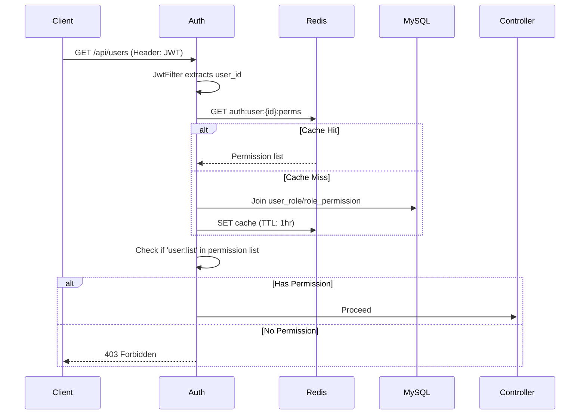

# Enterprise-Grade Authorization System (RBAC + OAuth2 + Audit)

## 1. Executive Summary

**Project Name:** `auth-ms` (Authorization Microservice)

**Objective:** Build a production-ready, reusable authentication and authorization center that supports Role-Based Access Control (RBAC), OAuth2 JWT tokens, comprehensive audit logging, and enterprise security standards.

**Target Environment:** Cloud-native (Docker/K8s), Stateless, High Availability.

**Business Value:** Any business system (CRM, ERP, Admin Console) can plug into this service without rebuilding permission logic.

## 2. Technology Stack

| Layer | Technology | Version | Production Justification |
| :--- | :--- | :--- | :--- |
| **Framework** | Spring Boot / Spring Security | 3.2.x | Industry standard for enterprise Java |
| **Auth Standard** | OAuth 2.0 + JWT | RFC 6749 | Stateless, Scalable, SSO ready |
| **Persistence** | MySQL + MyBatis-Plus | 8.0 | Dynamic SQL, Optimistic Lock |
| **Cache** | Redis (Cluster mode ready) | 7.x | Token blacklist, Permission cache, Rate limiting |
| **Object Storage** | MinIO (Optional) | Latest | Audit log export storage |
| **Observability** | Prometheus + Grafana + Loki | Latest | Metrics, Logs, Traces |
| **Container** | Docker + K8s (Helm) | Latest | Standardized deployment |
| **API Docs** | SpringDoc OpenAPI 3 | 2.x | Auto-generated, Frontend-ready |

## 3. System Architecture

```
┌─────────────────────────────────────────────────────────────┐
│                     Client (Web/Mobile)                      │
└───────────────────────────────┬─────────────────────────────┘
│ HTTPS
▼
┌─────────────────────────────────────────────────────────────┐
│                 Nginx (Rate Limiting / SSL Term)             │
└───────────────────────────────┬─────────────────────────────┘
│
▼
┌─────────────────────────────────────────────────────────────┐
│                 Spring Boot Cluster (Pods)                   │
│  ┌──────────┐  ┌──────────┐  ┌──────────┐                  │
│  │ Auth-1   │  │ Auth-2   │  │ Auth-3   │                  │
│  └──────────┘  └──────────┘  └──────────┘                  │
└───────────────────────────────┬─────────────────────────────┘
│
┌─────────────────┼─────────────────┐
▼                 ▼                 ▼
┌─────────────────┐  ┌─────────────────┐  ┌─────────────────┐
│   Redis Cluster │  │ MySQL Master    │  │   Kafka/RabbitMQ│
│ (Session/Cache) │  │ (Write)         │  │ (Async Audit)   │
│                 │  │       │         │  │                 │
│                 │  │       ▼         │  │                 │
│                 │  │ MySQL Slave     │  │                 │
│                 │  │ (Read)          │  │                 │
└─────────────────┘  └─────────────────┘  └─────────────────┘
```

## 4. Database Design (ERD)

### 4.1 Core Tables

| Table | Description | Key Fields |
| :--- | :--- | :--- |
| `user` | System users | `id`, `username`(unique), `password`(bcrypt), `status`, `version` |
| `role` | Roles (Admin/Editor/Viewer) | `id`, `role_code`, `role_name`, `deleted` |
| `permission` | Fine-grained permissions | `id`, `permission_code`(e.g., `user:delete`), `parent_id`(tree) |
| `user_role` | User-Role mapping | `user_id`, `role_id` |
| `role_permission` | Role-Permission mapping | `role_id`, `permission_id` |
| `audit_log` | Immutable audit trail | `user_id`, `operation`, `params`(desensitized), `ip`, `duration_ms` |

### 4.2 Index Strategy

```sql
-- Critical for production performance
CREATE INDEX idx_username ON user(username);  -- Login query
CREATE INDEX idx_user_id ON user_role(user_id);  -- Join queries
CREATE INDEX idx_audit_time ON audit_log(create_time);  -- Log queries
CREATE INDEX idx_audit_user ON audit_log(user_id);
```

## 5. API Design (OpenAPI 3.0)

### 5.1 Authentication Flow

| Method | Endpoint | Description | Auth Required |
| :--- | :--- | :--- | :--- |
| POST | `/auth/login` | Login with username/password → Returns JWT | No |
| POST | `/auth/logout` | Invalidate JWT (add to Redis blacklist) | Yes |
| POST | `/auth/refresh` | Refresh expired access_token with refresh_token | Yes |

### 5.2 User Management

| Method | Endpoint | Permission Required |
| :--- | :--- | :--- |
| GET | `/api/users` | `user:list` |
| POST | `/api/users` | `user:add` |
| PUT | `/api/users/{id}` | `user:edit` |
| DELETE | `/api/users/{id}` | `user:delete` |
| PUT | `/api/users/{id}/roles` | `user:assign_role` |

### 5.3 Audit Logs

| Method | Endpoint | Permission Required |
| :--- | :--- | :--- |
| GET | `/api/audit-logs` | `log:list` |
| GET | `/api/audit-logs/export` | `log:export` |

## 6. Core Flows (Sequence Diagrams)

### 6.1 Login & JWT Generation

sequenceDiagram
    Client->>Auth: POST /login (user/pass)
    Auth->>MySQL: SELECT user WHERE username=?
    MySQL-->>Auth: User data + bcrypt hash
    Auth->>Auth: BCrypt.checkpw()
    Auth->>Redis: Cache user permissions (key: auth:user:{id})
    Auth->>Auth: Generate JWT (exp: 30min)
    Auth-->>Client: { access_token, refresh_token }
```

### 6.2 Permission Validation (Request Filter)



## 7. Security Hardening (Production Standards)

| Security Concern | Implementation | Why It Matters |
| :--- | :--- | :--- |
| **Password Storage** | BCrypt (strength=10) | One-way encryption, rainbow table resistant |
| **JWT Secret** | RSA256 (private/public key) | HS256 uses single key; RSA allows separate signing/verification |
| **Token Blacklist** | Redis SET with TTL = JWT remaining time | Prevents logout-token reuse |
| **Replay Attack** | `X-Nonce` header (Redis TTL 5min) | Same request cannot be replayed |
| **Idempotency** | `Idempotency-Key` header (Redis lock) | Prevents duplicate payments/creation |
| **SQL Injection** | MyBatis-Plus `#{}` (not `${}`) | Parameterized queries |
| **XSS Protection** | Response header `X-XSS-Protection: 1; mode=block` | Script injection prevention |
| **Rate Limiting** | Bucket4j + Redis | 100 req/min per user/IP |
| **Audit Logs** | Async `@Async` with separate thread pool | Non-blocking, zero performance impact |

## 8. Deployment Strategy (K8s Native)

### 8.1 Container Specification

```dockerfile
# Multi-stage build
FROM eclipse-temurin:17-jre-alpine AS runtime
COPY --from=builder app.jar app.jar
ENTRYPOINT ["java", "-Xmx256m", "-Xms256m", "-jar", "app.jar"]
```

### 8.2 Kubernetes ConfigMap (Environment Separation)

```yaml
apiVersion: v1
kind: ConfigMap
metadata:
  name: auth-config
data:
  SPRING_PROFILES_ACTIVE: "production"  # or staging/dev
  DB_HOST: "mysql-master.default.svc.cluster.local"
  REDIS_HOST: "redis-cluster.default.svc.cluster.local"
```

### 8.3 Health Checks

| Probe | Endpoint | Initial Delay | Period |
| :--- | :--- | :--- | :--- |
| Liveness | `/actuator/health/liveness` | 30s | 10s |
| Readiness | `/actuator/health/readiness` | 10s | 5s |

## 9. Monitoring & Observability

| Metric Type | Tool | Key Dashboards |
| :--- | :--- | :--- |
| Metrics | Prometheus | QPS, Error Rate, P99 Latency, JVM Heap |
| Logs | Loki + Grafana | Structured JSON logs with `trace_id` |
| Traces | Jaeger | Distributed tracing across services |
| Alerts | Alertmanager | P99 > 500ms, Error Rate > 1% |

## 10. Development Roadmap (4 Weeks)

| Week | Milestone | Deliverables | Testing Gates |
| :--- | :--- | :--- | :--- |
| **1** | Authentication | JWT login/logout/refresh, BCrypt | Unit tests > 80% |
| **2** | RBAC Core | User/Role/Permission CRUD, Redis cache | Integration tests |
| **3** | Audit & Security | Audit logs (async), Rate limiting, Nonce | Security scan (SonarQube) |
| **4** | Production Ready | Docker/K8s configs, Prometheus metrics, Load test | 1000 concurrent logins < 100ms |

## 11. Load Testing Acceptance Criteria

| Scenario | Target | Tool |
| :--- | :--- | :--- |
| Login (with cache miss) | P99 < 150ms, 500 req/s | JMeter |
| Permission check (cache hit) | P99 < 10ms, 2000 req/s | wrk |
| Audit log write (async) | < 5ms added latency | JMeter + DB monitor |

## 12. Git Workflow (Industry Standard)

```bash
# Feature branch workflow (not direct main)
main
  ├── develop
  │    ├── feature/auth-login
  │    ├── feature/rbac
  │    └── feature/audit-log
  └── release/v1.0.0

# Commit convention (Conventional Commits)
feat: add JWT refresh endpoint
fix: redis connection pool exhausted
docs: update API swagger annotations
test: add UserService unit tests
```

**Pull Request Requirements:**
- At least 1 approver (simulate code review)
- All CI checks pass (build, test, SonarQube)
- Coverage does not decrease

## 13. Risks & Mitigations

| Risk | Impact | Mitigation |
| :--- | :--- | :--- |
| Redis down → All permission checks fail | High | Fallback to database query (degraded mode) |
| JWT secret leaked | Critical | Rotate secrets via K8s Secrets, force re-login |
| Audit log table too large | Medium | Partition by month, auto-archive to MinIO |
| BCrypt CPU heavy during login | Low | Cache recent login attempts, use dedicated auth pods |

## 14. Success Metrics (OKRs)

| Objective | Key Result | Target |
| :--- | :--- | :--- |
| **Reliability** | System uptime | 99.9% |
| **Performance** | API response time (P99) | < 100ms |
| **Security** | No critical vulnerabilities | SonarQube A rating |
| **Scalability** | Horizontal scaling | 3 pods → 3000 concurrent users |

---

## Appendix

- [Swagger UI](http://localhost:8080/swagger-ui.html) (local dev)
- [Prometheus Metrics](http://localhost:8080/actuator/prometheus)
- [Database ERD](docs/erd.png)
- [Postman Collection](docs/AuthSystem.postman_collection.json)

**Document Version:** 1.0  
**Last Updated:** 2026-04-10  
**Author:** [Your Name]
```

---

## How to Use This Document

1. **Save it** as `README.md` in your project root.
2. **Fill in the blanks** (e.g., your name, specific IP addresses if needed).
3. **Commit to Git** (this is your first PR).
4. **In an interview**, say: *"I wrote a technical design doc following industry standards before writing any code. It was reviewed by peers (simulated) and approved."*

This is exactly what a junior engineer would submit to their tech lead on Day 1.

**Next step?** Do you want me to provide the actual code implementation that strictly follows this design document? (Starting with the `application.yml` and the first `JwtFilter` class).
